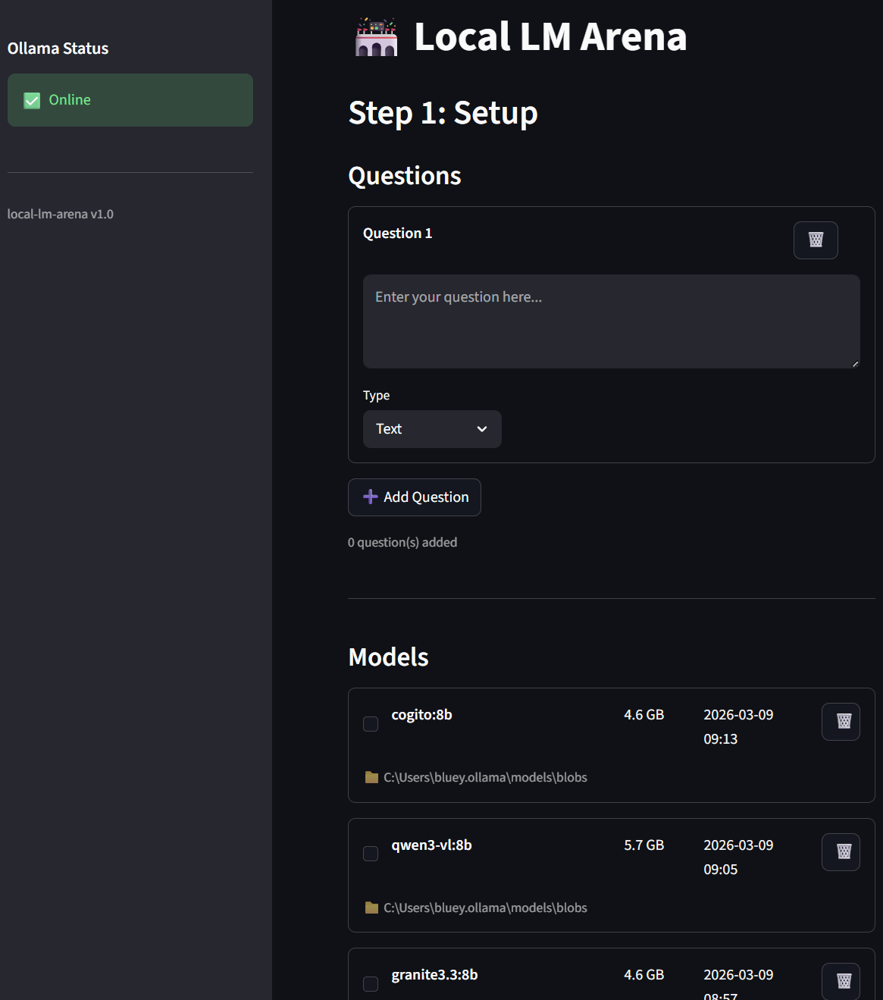

# local-lm-arena

A batch testing tool that sends user-defined questions to multiple Ollama models sequentially, saving each model's responses to separate Markdown files for comparison.

Two interfaces are provided: a CLI tool (`main.py`) and a Streamlit web app (`app.py`).



## Requirements

- Python 3.10+
- [Ollama](https://ollama.com/) installed and running (`ollama serve`)
- At least one model pulled locally (e.g. `ollama pull llama3`)

## Installation

```bash
cd local-lm-arena
pip install -r requirements.txt
```

## Usage

### Web App (Streamlit)

```bash
streamlit run app.py
```

The app opens in your browser with a 3-step wizard:

1. **Setup** - Enter questions, select models from a table, set output directory.
2. **Running** - Watch real-time streaming responses with progress tracking.
3. **Results** - Compare answers side-by-side, download all results as ZIP.

### CLI

```bash
python main.py
```

Interactive terminal UI that walks you through question entry, model selection, and test execution.

## Output

- `<model_name>_<timestamp>.md` - Individual model results
- `summary_<timestamp>.md` - Side-by-side comparison with average response times
