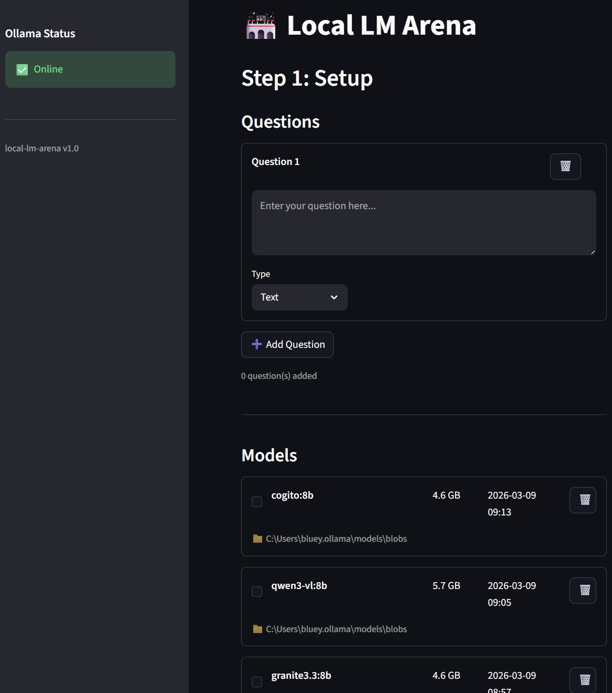

# local-lm-arena

A batch testing tool for running questions against multiple local LLMs simultaneously — served by **Ollama** or **LM Studio** — comparing their responses side by side and saving results as Markdown files.



---

## Features

- **Two backends** — Run models served by **Ollama** or **LM Studio** (OpenAI-compatible API); choose the backend at the top of the setup screen
- **Card-based question builder** — Add/remove questions individually, set type (Text or Code), choose language for code questions
- **Batch testing** — Test multiple models in one run, results saved per model and as a combined summary
- **Real-time streaming (Ollama)** — Watch responses appear token by token with progress tracking; LM Studio runs non-streaming with a spinner
- **Timeout & loop detection** — Configurable per-question timeout (both backends); automatic repetition detection stops looping models on the streaming path (Ollama)
- **Model management** — Ollama: view installed models with file path and size, pull and delete from the UI; LM Studio: connect to the server and select loaded models
- **Two interfaces** — Streamlit web app (`app.py`, both backends) and interactive CLI (`main.py`, Ollama)

---

## Requirements

- Python 3.10+
- One of the following backends:
  - **[Ollama](https://ollama.com/)** installed and running (`ollama serve`) with at least one model pulled (e.g. `ollama pull llama3`), **or**
  - **[LM Studio](https://lmstudio.ai/)** with its local server running (default `http://localhost:1234`) and a model loaded

## Installation

```bash
pip install -r requirements.txt
```

## Usage

### Web App

```bash
streamlit run app.py
```

3-step wizard: **Setup → Running → Results**

At the top of **Setup**, pick the backend:
- **Ollama** — uses installed Ollama models (pull/delete supported).
- **LM Studio** — enter the server **Base URL** (default `http://localhost:1234`) and an optional API key, click **Connect & Fetch Models**, then select models to test.

See [docs/llm_master_benchmark_en.md](docs/llm_master_benchmark_en.md) for full details on the LM Studio backend.

### CLI

```bash
python main.py
```

> The CLI targets Ollama. LM Studio support is available in the web app.

---

## Benchmark Results

All results from benchmark runs are available in [`lm-arena-results/`](lm-arena-results/).

### General Models — [`lm-arena-results/general/`](lm-arena-results/general/)

40 general-purpose models tested (8B–35B): Qwen3, Llama3, DeepSeek-R1, Granite, Phi4, Aya, Mistral, StableLM, Yi and more.

| File | Description |
|------|-------------|
| [model_evaluation.md](docs/model_evaluation.md) | Scoring and evaluation of all tested models |
| [model_guide.md](docs/model_guide.md) | Model comparison guide and recommendations |
| [model_evaluation_en.xlsx](docs/model_evaluation_en.xlsx) | Evaluation spreadsheet (v1) |
| [model_evaluation_en_v2.xlsx](docs/model_evaluation_en_v2.xlsx) | Evaluation spreadsheet (v2) |

### Abliterated Models — [`lm-arena-results/abliterated/`](lm-arena-results/abliterated/)

15 uncensored/abliterated variants tested (3.8B–32B): huihui_ai series, Dolphin3, ExaOne-Deep, GPT-OSS, Mistral-Small, Phi4-Reasoning, QwQ, Qwen3-Coder and others.

| File | Description |
|------|-------------|
| [abliterated_model_report.xlsx](docs/abliterated_model_report.xlsx) | Full abliterated model benchmark report |

### Coding Models — [`lm-arena-results/coder/`](lm-arena-results/coder/)

80 coding-focused models benchmarked across 4 size tiers:

| Tier | Size | Models | Folder |
|------|------|--------|--------|
| Kat A | 0.5B – 3.8B | 28 | [`coder/kat A/`](lm-arena-results/coder/kat%20A/) |
| Kat B | 6B – 9B | 18 | [`coder/kat B/`](lm-arena-results/coder/kat%20B/) |
| Kat C | 12B – 30B | 14 | [`coder/kat C/`](lm-arena-results/coder/kat%20C/) |
| Kat D | 22B – 34B | 20 | [`coder/kat D/`](lm-arena-results/coder/kat%20D/) |

Models include: CodeGemma, CodeLlama, DeepSeek-Coder, DeepCoder, StarCoder2, OpenCoder, Granite-Code, Qwen2.5-Coder, Qwen3-Coder, Devstral, Codestral, Magistral, ExaOne-Deep, WizardLM2, QwQ and more.

| File | Description |
|------|-------------|
| [fullstack_results_en.xlsx](docs/fullstack_results_en.xlsx) | Full coding benchmark analysis and scores |

---

## Output Format

Each test run produces:
- `<model>_<timestamp>.md` — per-model responses with timing
- `summary_<timestamp>.md` — side-by-side comparison across all models (the header records the backend used)
